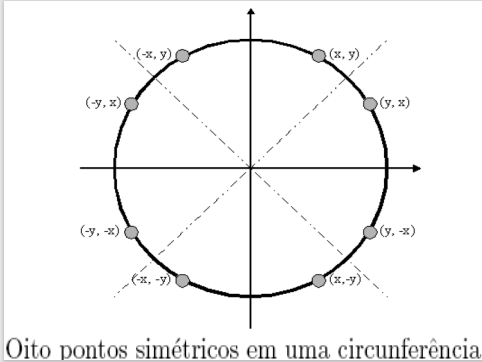

# T3-Pratica-circunferenciaOtimizada
```Desenhar uma circunferência otimizada. Código fonte e Apresentação  (explicando a técnica e os detalhes da implementação).```
https://turing.inf.ufg.br/pluginfile.php/155869/mod_resource/content/1/CG7Trac%CC%A7adodeCi%CC%81rculos.pdf 

#### Grupo 1 - CG
#### Universidade Federal de Goiás - Instituto de Informática
#### Disciplina: Computação Gráfica
#### Prof.ª: DELLER JAMES FERREIRA
#### Alunos:
##### Matheus Lázaro Honório da Silva - 201801523
##### Gabriel Crispim de Siqueira - 201801496
##### Guilherme Araújo França - 202003569
##### Thais Gonçalves da Silva - 202003617

## Apresentação da técnica e detalhes da implementação
* O <b>algoritmo do ponto-médio para circunferências</b> é um <u>método incremental</u> que usa apenas aritmética inteira e aproveita a simetria da circunferência, traçando apenas um arco de 45° e usando uma função auxiliar para desenhar os outros pontos simétricos.

* O algoritmo é baseado na função <b>F(x, y) = x^2 + y^2 - R^2</b>, que é <u>zero sobre a circunferência, positiva fora dela e negativa dentro</u>. Consiste em escolher entre dois pixels candidatos, E e SE, a partir do valor da função no ponto médio entre eles. Se o ponto médio está fora da circunferência, o pixel SE é escolhido, caso contrário, o pixel E é escolhido.

* O algoritmo também usa uma <b>variável de decisão d</b>, que é inicializada como d = 1 - R, e é atualizada a cada iteração, dependendo do pixel escolhido. Se d < 0, o pixel E é escolhido, e d é atualizado como d = d + 2 * x + 1. Se d >= 0, o pixel SE é escolhido, e d é atualizado como d = d + 2 * (x - y) + 1.


* O algoritmo termina quando x >= y, ou seja, quando o arco de 45° é completado. A função auxiliar <b>CirclePoints</b> é usada para <u>desenhar os oito pontos simétricos de cada pixel gerado pelo algoritmo, usando a função glBegin com o parâmetro GL_POINTS para desenhar cada pixel na tela</u>.


* O algoritmo do ponto-médio também evita gaps e variações de espessura na circunferência, mantendo uma densidade uniforme de pixels.
    * <u>Gaps</u>: são espaços vazios entre os pixels que formam a circunferência, que podem comprometer a continuidade e a suavidade da figura.
    * <u>Variações de espessura</u>: são diferenças no tamanho dos pixels que formam a circunferência, que podem comprometer a uniformidade e a simetria da figura.

## Compilação:
```shell
gcc -c circunferenciaOtimizada.c -lGL -lGLU -lglut -lm

gcc -o circunferenciaOtimizada circunferenciaOtimizada.c -lGL -lGLU -lglut -lm

./circunferenciaOtimizada
```
